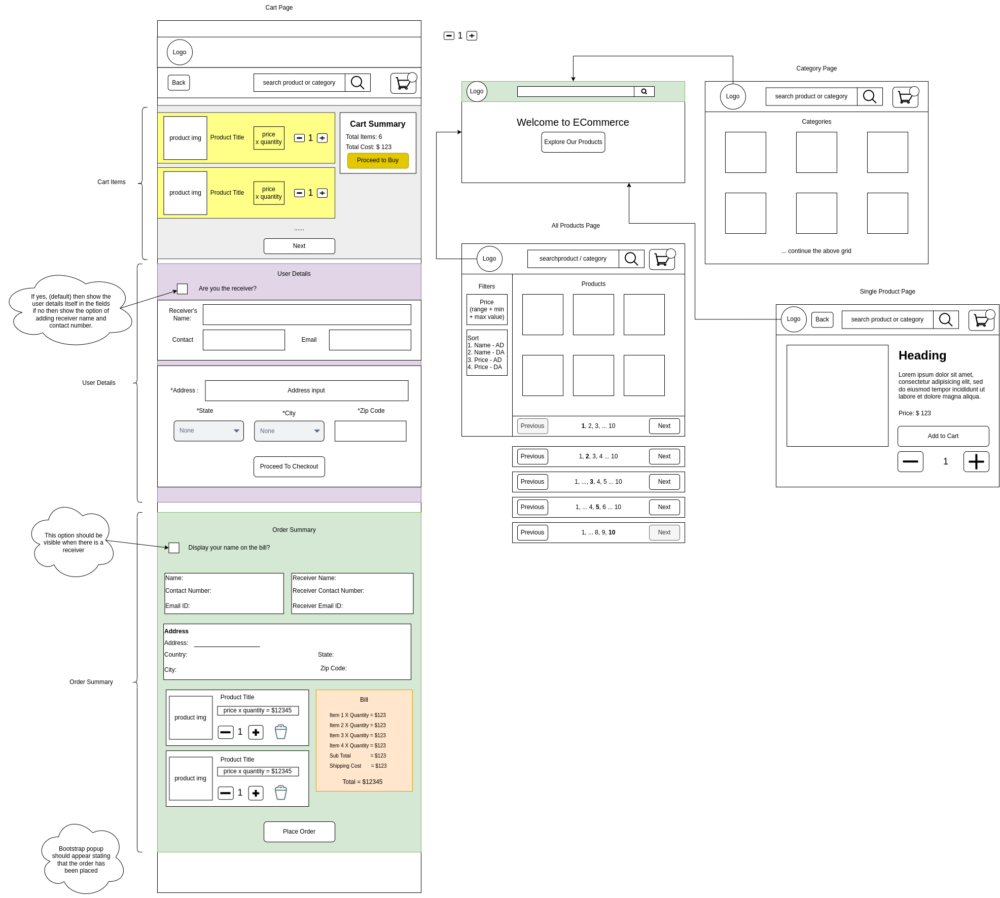

# eCommerce

## APIs that I tested

1. [Fake Store API](https://fakestoreapi.com/)
2. [Dummy JSON](https://dummyjson.com/)
3. [Store Rest API](https://storerestapi.com/)

## Icons

[svgrepo](https://www.svgrepo.com/)

## Pages

1. Home
2. All Products
3. Category
4. Single Product Page
5. Cart Page:
   1. Cart
   2. User Details
   3. Order Summary

## Features

1. Search 
   1. by products
   2. by category
2. Filters:
   1. Price 
      1. Range
      2. Min and max input
  
3. Sort:
   1. Name - AD ⬇️
   2. Name - DA ⬆️
   3. Price - AD ⬇️
   4. Price - DA ⬆️

## Rough Scketch

